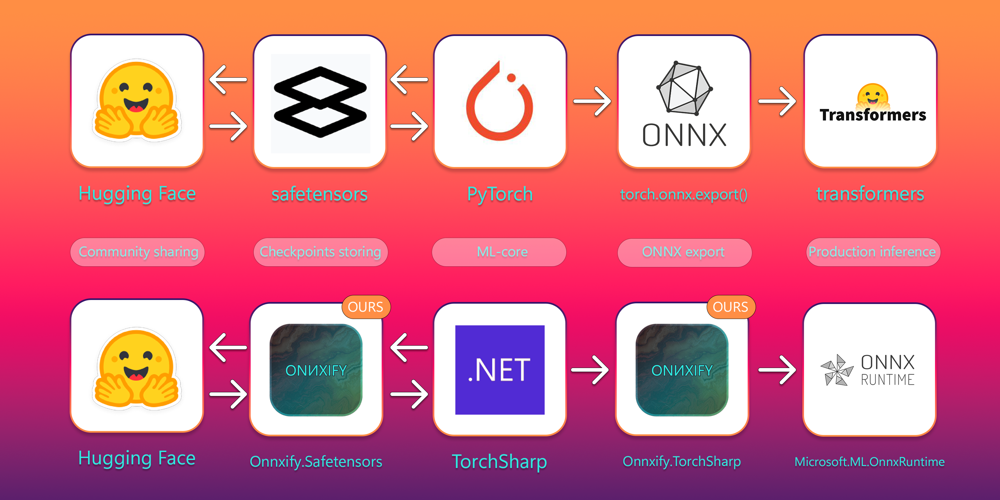

# Onnxify

Onnxify is an experimental .NET library for reading, inspecting, and writing ONNX models.



Machine learning workflows are often difficult not because models are impossible to run, but because they are difficult to understand, inspect, adapt, and carry from one environment to another. A lot of useful work happens in that space between research and production, where people need clarity, control, and confidence rather than another opaque black box. Onnxify exists for that middle ground.

The idea behind this repository is simple: models should be easier to work with, easier to reason about, and easier to integrate into real development workflows. If ONNX is meant to be a common language for models, then the tools around it should help people move faster, make smaller changes safely, and build their own workflows without unnecessary friction. That is the direction Onnxify is trying to push.

The core `Onnxify` package can load and save models from files or streams with both synchronous and asynchronous APIs: `OnnxModel.FromFile(...)`, `FromFileAsync(...)`, `FromStream(...)`, `FromStreamAsync(...)`, `model.Save(...)`, and `model.SaveAsync(...)`.

[](https://github.com/gluschenko/onnxify/actions/workflows/github-ci.yml)

## NuGet Packages

The repository currently implements the following NuGet packages. Package-specific instructions live in [`.docs/nuget`](.docs/nuget).

| Labrary                                                               | NuGet Package                                                                                                                            |
| --------------------------------------------------------------------- | :--------------------------------------------------------------------------------------------------------------------------------------- |
| [`Onnxify`](.docs/nuget/Onnxify.md)                                   | [](https://www.nuget.org/packages/Onnxify/)                                   |
| [`Onnxify.TorchSharp`](.docs/nuget/Onnxify.TorchSharp.md)             | [](https://www.nuget.org/packages/Onnxify.TorchSharp/)             |
| [`Onnxify.Safetensors`](.docs/nuget/Onnxify.Safetensors.md)           | [](https://www.nuget.org/packages/Onnxify.Safetensors/)           |
| [`Onnxify.ProjectGenerator`](.docs/nuget/Onnxify.ProjectGenerator.md) | [](https://www.nuget.org/packages/Onnxify.ProjectGenerator/) |
| [`Onnxify.ModelGenerator`](.docs/nuget/Onnxify.ModelGenerator.md)     | [](https://www.nuget.org/packages/Onnxify.ModelGenerator/)     |
| [`Onnxify.ML`](.docs/nuget/Onnxify.ML.md)                             | [](https://www.nuget.org/packages/Onnxify.ML/)                             |
| [`Onnxify.ML.TorchSharp`](.docs/nuget/Onnxify.ML.TorchSharp.md)       | [](https://www.nuget.org/packages/Onnxify.ML.TorchSharp/)       |
| [`Onnxify.HuggingFace`](.docs/nuget/Onnxify.HuggingFace.md)           | [](https://www.nuget.org/packages/Onnxify.HuggingFace/)           |
| [`Onnxify.CLI`](.docs/nuget/Onnxify.CLI.md)                           | [](https://www.nuget.org/packages/Onnxify.CLI/)                           |                  

## Requirements

- .NET 8 SDK + .NET 10 SDK
- Windows 11 or Linux-based system
- NuGet packages are cross-platform for consumer projects

## Getting Started

Clone the repository and build the solution.

Windows:

```powershell
git clone --recurse-submodules https://github.com/gluschenko/onnxify.git
cd onnxify
dotnet build src\Onnxify.slnx
```

Linux:

```bash
git clone --recurse-submodules https://github.com/gluschenko/onnxify.git
cd onnxify
dotnet build src/Onnxify.slnx
```

To pack and install the local `Onnxify.CLI` tool from this repository:

Windows:

```powershell
.\install-onnxify-cli.ps1
```

Linux:

```bash
chmod +x ./install-onnxify-cli.sh
./install-onnxify-cli.sh
```

To install or refresh the bundled Codex skills from this repository:

Windows:

```powershell
.\install-onnxify-skills.ps1
```

Linux:

```bash
chmod +x ./install-onnxify-skills.sh
./install-onnxify-skills.sh
```

Both install scripts support help output:

Windows:

```powershell
.\install-onnxify-cli.ps1 -Help
.\install-onnxify-skills.ps1 -Help
```

Linux:

```bash
./install-onnxify-cli.sh --help
./install-onnxify-skills.sh --help
```

## Install the Codex Skill

This section is optional. If you only want to consume the NuGet packages in your own .NET project, you do not need the Codex skill.

If you use Codex and want repository-specific help for `Onnxify`, `Onnxify.TorchSharp`, and the related package family, you can install the bundled `onnxify` skill directly from GitHub without cloning the repository.

Windows:

```powershell
$codexHome = if ($env:CODEX_HOME) { $env:CODEX_HOME } else { Join-Path $HOME ".codex" }

py -3 "$codexHome\skills\.system\skill-installer\scripts\install-skill-from-github.py" `
  --repo gluschenko/onnxify `
  --path .agents/skills/onnxify
```

Linux:

```bash
codex_home="${CODEX_HOME:-$HOME/.codex}"

python3 "$codex_home/skills/.system/skill-installer/scripts/install-skill-from-github.py" \
  --repo gluschenko/onnxify \
  --path .agents/skills/onnxify
```

You can also install it by URL instead of `--repo` and `--path`.

Windows:

```powershell
$codexHome = if ($env:CODEX_HOME) { $env:CODEX_HOME } else { Join-Path $HOME ".codex" }

py -3 "$codexHome\skills\.system\skill-installer\scripts\install-skill-from-github.py" `
  --url "https://github.com/gluschenko/onnxify/tree/main/.agents/skills/onnxify"
```

Linux:

```bash
codex_home="${CODEX_HOME:-$HOME/.codex}"

python3 "$codex_home/skills/.system/skill-installer/scripts/install-skill-from-github.py" \
  --url "https://github.com/gluschenko/onnxify/tree/main/.agents/skills/onnxify"
```

If you already cloned this repository and want to install both bundled skills from the local checkout, use the `install-onnxify-skills.ps1` or `install-onnxify-skills.sh` scripts shown in [Getting Started](#getting-started).

Restart Codex after installation so it picks up the new or refreshed skill files.

## TODO

- [x] OnnxGraph rework
- [x] SourceGenerator: operator type annotations
- [ ] SourceGenerator: fully-typed operator Input/Output fields (OneOf?)
- [x] Async I/O ops
- [ ] Graph edges in a single collection (or in two for placeholders)
- [ ] Graph manipulations: add nodes, remove nodes, replace nodes
- [ ] Graph cyclicity validation
- [x] CLI for agents and humans (to explore ONNX files)
- [x] Project generator generates operator nodes
- [x] Parse pytorch\torch\onnx\_internal\torchscript_exporter (create MD with support status)
- [x] Generate agent skills from operator-schema.json
- [x] ToString for OnnxModel, OnnxNode, OnnxxTensor, etc (recursive?)
- [x] OnnxDataProvider, SafetensorsDataProvider, BaseDataProvider...
- [x] Agent skills for Export implementation on Torch modules
- [x] Allow to add or remove OnnxModel meta (training info, imports, producer, version)
- [ ] CLI redesign: command patterns, more features, better output formatting, etc
- [ ] NuGet integration tests
- [ ] Safetensors: more user-friendly API

## License

This repository is licensed under the terms of the [LICENSE](LICENSE) file.
