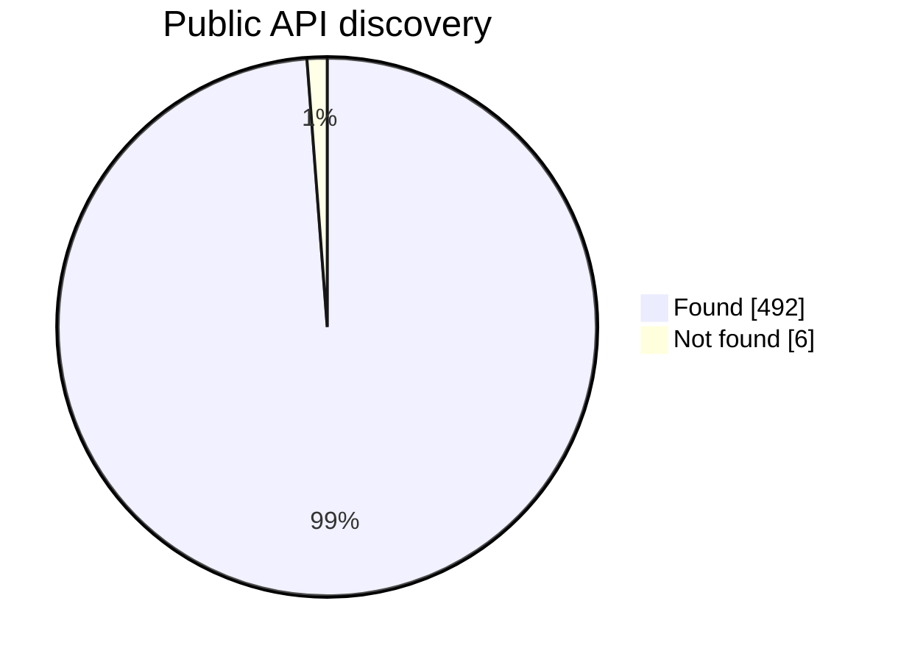
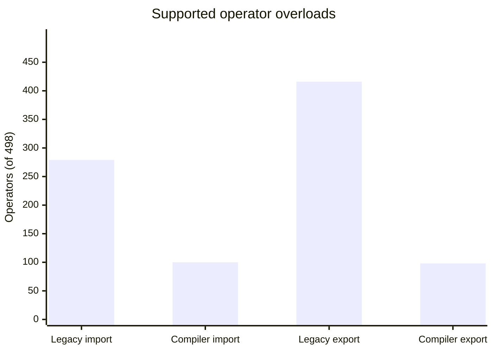

# TorchSharp operator coverage

* Found: 98.80% (492/498)
* Importable (legacy): 56.02% (279/498)
* Exportable (legacy): 83.53% (416/498)
* Importable (compiler): 20.08% (100/498)
* Exportable (compiler): 19.68% (98/498)

## Coverage Charts

The discovery chart shows whether a matching public API was found. The support chart compares independent coverage flags; an operator can be supported by both implementations.

## Package Versions

Current versions and direct dependencies are read from the publishable `Onnxify.*` project files under `src/`.

### `Onnxify`

* Version: `0.4.0`
* Onnxify project references:
  * None
* Third-party NuGet PackageReferences:
  * `Google.Protobuf` `3.34.0`
  * `Grpc.Tools` `2.78.0`
  * `System.Collections.Immutable` `9.0.0` ('$(TargetFramework)'=='netstandard2.0')
  * `System.Text.Json` `10.0.9` ('$(TargetFramework)'=='netstandard2.0')

### `Onnxify.CLI`

* Version: `0.4.0`
* Onnxify project references:
  * `Onnxify`
  * `Onnxify.HuggingFace`
  * `Onnxify.ML`
  * `Onnxify.ML.TorchSharp`
  * `Onnxify.ProjectGenerator`
  * `Onnxify.Safetensors`
  * `Onnxify.TorchSharp`
* Third-party NuGet PackageReferences:
  * None

### `Onnxify.Compiler`

* Version: `0.4.0`
* Onnxify project references:
  * `Onnxify`
* Third-party NuGet PackageReferences:
  * `ICSharpCode.Decompiler` `10.0.1.8346`
  * `Microsoft.CodeAnalysis.CSharp` `4.11.0`

### `Onnxify.HuggingFace`

* Version: `0.4.0`
* Onnxify project references:
  * None
* Third-party NuGet PackageReferences:
  * None

### `Onnxify.ML`

* Version: `0.4.0`
* Onnxify project references:
  * None
* Third-party NuGet PackageReferences:
  * None

### `Onnxify.ML.TorchSharp`

* Version: `0.4.0`
* Onnxify project references:
  * `Onnxify.ML`
* Third-party NuGet PackageReferences:
  * `TorchSharp` `0.107.0`

### `Onnxify.ModelGenerator`

* Version: `0.4.0`
* Onnxify project references:
  * `Onnxify`
  * `Onnxify.Compiler`
* Third-party NuGet PackageReferences:
  * `Google.Protobuf` `3.34.0`
  * `Grpc.Tools` `2.78.0`
  * `ICSharpCode.Decompiler` `10.0.1.8346`
  * `Microsoft.CodeAnalysis.Analyzers` `3.11.0`
  * `Microsoft.CodeAnalysis.CSharp` `4.11.0`
  * `System.Collections.Immutable` `9.0.0`

### `Onnxify.ProjectGenerator`

* Version: `0.4.0`
* Onnxify project references:
  * `Onnxify`
* Third-party NuGet PackageReferences:
  * None

### `Onnxify.Safetensors`

* Version: `0.4.0`
* Onnxify project references:
  * None
* Third-party NuGet PackageReferences:
  * None

### `Onnxify.TorchSharp`

* Version: `0.4.0`
* Onnxify project references:
  * `Onnxify`
  * `Onnxify.Compiler`
  * `Onnxify.Safetensors`
* Third-party NuGet PackageReferences:
  * `ICSharpCode.Decompiler` `10.0.1.8346`
  * `Microsoft.ML.OnnxRuntime.Managed` `1.20.2`
  * `TorchSharp` `0.107.0`

## Coverage Columns

* `Found` means reflection found a likely matching public TorchSharp or TorchVision API or module for the ONNXScript Torch operator name. This is a discovery signal, not an Onnxify implementation guarantee.
* `Exportable (legacy)` means the exact ONNXScript Torch operator is registered in the actual `Onnxify.TorchSharp` deep-export coverage set through `[TorchOp(...)]`.
* `Importable (legacy)` means the observer can map the ONNXScript Torch operator to expected ONNX `OpType` nodes and every mapped `OpType` is registered in the actual `Onnxify.ModelGenerator` TorchModule deep-import registries.
* `Importable (compiler)` means a compiler mapping can import the ONNX operator and print it as TorchSharp C# (`Bidirectional` or `ImportOnly`).
* `Exportable (compiler)` means a compiler mapping can scan the TorchSharp operator and emit ONNX (`Bidirectional` or `ExportOnly`).
* `Onnxify.Tests tests` is the number of `[Fact]` / `[Theory]` test methods in `src/Onnxify.Tests` whose name or body mentions the ONNXScript operator, normalized TorchSharp API name, or a known operator alias.
* `✅` means the category is covered/found. `❌` means it is not covered/found.

| ONNXScript operator | TorchSharp module | Found | Importable (legacy) | Exportable (legacy) | Importable (compiler) | Exportable (compiler) | Onnxify.Tests tests |
| --- | --- | --- | --- | --- | --- | --- | --- |
| `_operator::__lshift__` | `TorchSharp.torch.bitwise_left_shift` | ✅ | ✅ | ✅ | ❌ | ❌ | 8 |
| `_operator::__rshift__` | `TorchSharp.torch.bitwise_right_shift` | ✅ | ✅ | ✅ | ❌ | ❌ | 9 |
| `_operator::abs` | `TorchSharp.torch.abs` | ✅ | ✅ | ✅ | ❌ | ❌ | 2 |
| `_operator::add` | `TorchSharp.torch.add` | ✅ | ✅ | ✅ | ❌ | ❌ | 13 |
| `_operator::and_` | `TorchSharp.torch.bitwise_and` | ✅ | ✅ | ✅ | ❌ | ❌ | 97 |
| `_operator::eq` | `TorchSharp.torch.eq` | ✅ | ✅ | ✅ | ❌ | ❌ | 6 |
| `_operator::floordiv` | `TorchSharp.torch.floor_divide` | ✅ | ✅ | ✅ | ❌ | ❌ | 4 |
| `_operator::ge` | `TorchSharp.torch.ge` | ✅ | ✅ | ✅ | ❌ | ❌ | 8 |
| `_operator::getitem` | `TorchSharp.torch+Tensor.TensorItems[indexer]` | ✅ | ❌ | ❌ | ❌ | ❌ | 0 |
| `_operator::gt` | `TorchSharp.torch.gt` | ✅ | ✅ | ✅ | ❌ | ❌ | 2 |
| `_operator::le` | `TorchSharp.torch.le` | ✅ | ✅ | ✅ | ❌ | ❌ | 12 |
| `_operator::lt` | `TorchSharp.torch.lt` | ✅ | ✅ | ✅ | ❌ | ❌ | 4 |
| `_operator::mod` | `TorchSharp.torch.remainder` | ✅ | ✅ | ✅ | ❌ | ❌ | 7 |
| `_operator::mul` | `TorchSharp.torch.mul` | ✅ | ✅ | ✅ | ❌ | ❌ | 16 |
| `_operator::ne` | `TorchSharp.torch.ne` | ✅ | ✅ | ✅ | ❌ | ❌ | 37 |
| `_operator::neg` | `TorchSharp.torch.neg` | ✅ | ✅ | ✅ | ❌ | ❌ | 2 |
| `_operator::or_` | `TorchSharp.torch.bitwise_or` | ✅ | ✅ | ✅ | ❌ | ❌ | 10 |
| `_operator::pow` | `TorchSharp.torch.pow` | ✅ | ✅ | ✅ | ❌ | ❌ | 4 |
| `_operator::sub` | `TorchSharp.torch.sub` | ✅ | ✅ | ✅ | ❌ | ❌ | 3 |
| `_operator::truediv` | `TorchSharp.torch.true_divide` | ✅ | ✅ | ✅ | ❌ | ❌ | 5 |
| `aten::__lshift__.Scalar` | `TorchSharp.torch.bitwise_left_shift` | ✅ | ✅ | ✅ | ❌ | ❌ | 8 |
| `aten::__rshift__.Scalar` | `TorchSharp.torch.bitwise_right_shift` | ✅ | ✅ | ✅ | ❌ | ❌ | 9 |
| `aten::_conj` | `TorchSharp.torch.conj` | ✅ | ❌ | ✅ | ❌ | ❌ | 1 |
| `aten::_embedding_bag` | `TorchSharp.Modules.EmbeddingBag` | ✅ | ❌ | ❌ | ❌ | ❌ | 0 |
| `aten::_embedding_bag_forward_only` | `TorchSharp.Modules.EmbeddingBag` | ✅ | ❌ | ❌ | ❌ | ❌ | 7 |
| `aten::_fft_c2c` | `TorchSharp.torch+fft.fft_` | ✅ | ❌ | ❌ | ❌ | ❌ | 0 |
| `aten::_fft_c2r` | `TorchSharp.torch+fft.fft_` | ✅ | ❌ | ❌ | ❌ | ❌ | 0 |
| `aten::_fft_r2c` | `TorchSharp.torch+fft.fft_` | ✅ | ❌ | ❌ | ❌ | ❌ | 0 |
| `aten::_linalg_det` | `TorchSharp.torch.det` | ✅ | ✅ | ✅ | ❌ | ❌ | 3 |
| `aten::_local_scalar_dense` | `TorchSharp.torch+Tensor.ToScalar` | ✅ | ❌ | ❌ | ❌ | ❌ | 19 |
| `aten::_log_softmax` | `TorchSharp.torch+Tensor.log_softmax` | ✅ | ✅ | ✅ | ❌ | ❌ | 8 |
| `aten::_native_batch_norm_legit` | `TorchSharp.Modules.BatchNorm` | ✅ | ✅ | ✅ | ❌ | ❌ | 8 |
| `aten::_native_batch_norm_legit.no_stats` | `TorchSharp.Modules.BatchNorm` | ✅ | ✅ | ✅ | ❌ | ❌ | 13 |
| `aten::_native_batch_norm_legit_functional` | `TorchSharp.Modules.BatchNorm` | ✅ | ✅ | ✅ | ❌ | ❌ | 10 |
| `aten::_native_batch_norm_legit_no_training` | `TorchSharp.Modules.BatchNorm` | ✅ | ✅ | ✅ | ❌ | ❌ | 14 |
| `aten::_prelu_kernel` | `TorchSharp.torch+Tensor.prelu` | ✅ | ❌ | ❌ | ❌ | ❌ | 0 |
| `aten::_scaled_dot_product_efficient_attention` | `TorchSharp.torch+nn+functional.scaled_dot_product_attention` | ✅ | ❌ | ❌ | ❌ | ❌ | 2 |
| `aten::_scaled_dot_product_flash_attention` | `TorchSharp.torch+nn+functional.scaled_dot_product_attention` | ✅ | ❌ | ❌ | ❌ | ❌ | 2 |
| `aten::_scaled_dot_product_flash_attention_for_cpu` | `TorchSharp.torch+nn+functional.scaled_dot_product_attention` | ✅ | ❌ | ❌ | ❌ | ❌ | 97 |
| `aten::_softmax` | `TorchSharp.torch.softmax` | ✅ | ✅ | ✅ | ❌ | ❌ | 0 |
| `aten::_to_copy` | `TorchSharp.torch+Tensor.to` | ✅ | ✅ | ✅ | ✅ | ✅ | 64 |
| `aten::_unique` | `TorchSharp.torch.unique` | ✅ | ❌ | ❌ | ❌ | ❌ | 0 |
| `aten::_unique2` | `TorchSharp.torch.unique` | ✅ | ❌ | ❌ | ❌ | ❌ | 0 |
| `aten::_unsafe_index.Tensor` | `TorchSharp.torch+Tensor.index` | ✅ | ❌ | ❌ | ❌ | ❌ | 6 |
| `aten::_unsafe_index_put` | `TorchSharp.torch+Tensor.index_put_` | ✅ | ❌ | ❌ | ❌ | ❌ | 6 |
| `aten::_unsafe_view` | `TorchSharp.torch+Tensor.view` | ✅ | ❌ | ❌ | ❌ | ❌ | 12 |
| `aten::_upsample_bicubic2d_aa` | `TorchSharp.Modules.Upsample` | ✅ | ✅ | ❌ | ❌ | ❌ | 2 |
| `aten::_upsample_bilinear2d_aa` | `TorchSharp.Modules.Upsample` | ✅ | ✅ | ❌ | ❌ | ❌ | 2 |
| `aten::abs` | `TorchSharp.torch.abs` | ✅ | ✅ | ✅ | ✅ | ✅ | 2 |
| `aten::acos` | `TorchSharp.torch.acos` | ✅ | ✅ | ✅ | ✅ | ✅ | 3 |
| `aten::acosh` | `TorchSharp.torch.acosh` | ✅ | ✅ | ✅ | ✅ | ✅ | 3 |
| `aten::add.Scalar` | `TorchSharp.torch.add` | ✅ | ✅ | ✅ | ✅ | ✅ | 10 |
| `aten::add.Tensor` | `TorchSharp.torch.add` | ✅ | ✅ | ✅ | ✅ | ✅ | 11 |
| `aten::addbmm` | `TorchSharp.torch.addbmm` | ✅ | ❌ | ✅ | ❌ | ❌ | 3 |
| `aten::addcdiv` | `TorchSharp.torch.addcdiv` | ✅ | ❌ | ✅ | ❌ | ❌ | 3 |
| `aten::addcmul` | `TorchSharp.torch.addcmul` | ✅ | ❌ | ✅ | ❌ | ❌ | 3 |
| `aten::addmm` | `TorchSharp.torch.addmm` | ✅ | ✅ | ✅ | ✅ | ✅ | 3 |
| `aten::addmv` | `TorchSharp.torch.addmv` | ✅ | ❌ | ✅ | ❌ | ❌ | 3 |
| `aten::addr` | `TorchSharp.torch.addr` | ✅ | ❌ | ✅ | ❌ | ❌ | 3 |
| `aten::alias` | `TorchSharp.torch+Tensor.alias` | ✅ | ✅ | ✅ | ❌ | ❌ | 3 |
| `aten::all` | `TorchSharp.torch.all` | ✅ | ❌ | ✅ | ❌ | ❌ | 10 |
| `aten::all.dim` | `TorchSharp.torch.all` | ✅ | ❌ | ✅ | ❌ | ❌ | 10 |
| `aten::all.dims` | `TorchSharp.torch.all` | ✅ | ❌ | ✅ | ❌ | ❌ | 10 |
| `aten::allclose` | `TorchSharp.torch.allclose` | ✅ | ❌ | ✅ | ❌ | ❌ | 3 |
| `aten::amax` | `TorchSharp.torch.amax` | ✅ | ✅ | ✅ | ❌ | ❌ | 2 |
| `aten::amin` | `TorchSharp.torch.amin` | ✅ | ✅ | ✅ | ❌ | ❌ | 3 |
| `aten::angle` | `TorchSharp.torch.angle` | ✅ | ❌ | ✅ | ❌ | ❌ | 2 |
| `aten::any` | `TorchSharp.torch.any` | ✅ | ❌ | ✅ | ❌ | ❌ | 5 |
| `aten::any.dim` | `TorchSharp.torch.any` | ✅ | ❌ | ✅ | ❌ | ❌ | 5 |
| `aten::any.dims` | `TorchSharp.torch.any` | ✅ | ❌ | ✅ | ❌ | ❌ | 5 |
| `aten::arange` | `TorchSharp.torch.arange` | ✅ | ❌ | ✅ | ❌ | ❌ | 4 |
| `aten::arange.start` | `TorchSharp.torch.arange` | ✅ | ❌ | ✅ | ❌ | ❌ | 5 |
| `aten::arange.start_step` | `TorchSharp.torch.arange` | ✅ | ❌ | ✅ | ❌ | ❌ | 6 |
| `aten::argmax` | `TorchSharp.torch.argmax` | ✅ | ✅ | ✅ | ❌ | ❌ | 2 |
| `aten::argmin` | `TorchSharp.torch.argmin` | ✅ | ✅ | ✅ | ❌ | ❌ | 2 |
| `aten::as_strided` | `TorchSharp.torch+Tensor.as_strided` | ✅ | ❌ | ✅ | ❌ | ❌ | 10 |
| `aten::asin` | `TorchSharp.torch.asin` | ✅ | ✅ | ✅ | ✅ | ✅ | 3 |
| `aten::asinh` | `TorchSharp.torch.asinh` | ✅ | ✅ | ✅ | ✅ | ✅ | 2 |
| `aten::atan` | `TorchSharp.torch.atan` | ✅ | ✅ | ✅ | ✅ | ✅ | 12 |
| `aten::atan2` | `TorchSharp.torch.atan2` | ✅ | ❌ | ✅ | ❌ | ❌ | 12 |
| `aten::atanh` | `TorchSharp.torch.atanh` | ✅ | ✅ | ✅ | ✅ | ✅ | 3 |
| `aten::atleast_1d` | `TorchSharp.torch.atleast_1d` | ✅ | ❌ | ✅ | ❌ | ❌ | 3 |
| `aten::atleast_1d.Sequence` | `TorchSharp.torch.atleast_1d` | ✅ | ❌ | ✅ | ❌ | ❌ | 3 |
| `aten::atleast_2d` | `TorchSharp.torch.atleast_2d` | ✅ | ❌ | ✅ | ❌ | ❌ | 3 |
| `aten::atleast_2d.Sequence` | `TorchSharp.torch.atleast_2d` | ✅ | ❌ | ✅ | ❌ | ❌ | 3 |
| `aten::atleast_3d` | `TorchSharp.torch.atleast_3d` | ✅ | ❌ | ✅ | ❌ | ❌ | 3 |
| `aten::atleast_3d.Sequence` | `TorchSharp.torch.atleast_3d` | ✅ | ❌ | ✅ | ❌ | ❌ | 3 |
| `aten::avg_pool1d` | `TorchSharp.Modules.AvgPool1d` | ✅ | ✅ | ✅ | ❌ | ❌ | 0 |
| `aten::avg_pool2d` | `TorchSharp.Modules.AvgPool2d` | ✅ | ✅ | ✅ | ❌ | ❌ | 1 |
| `aten::avg_pool3d` | `TorchSharp.Modules.AvgPool3d` | ✅ | ✅ | ✅ | ❌ | ❌ | 0 |
| `aten::baddbmm` | `TorchSharp.torch.baddbmm` | ✅ | ❌ | ✅ | ❌ | ❌ | 3 |
| `aten::bernoulli` | `TorchSharp.torch.bernoulli` | ✅ | ❌ | ✅ | ❌ | ❌ | 2 |
| `aten::bernoulli.p` | `TorchSharp.torch.bernoulli` | ✅ | ❌ | ✅ | ❌ | ❌ | 2 |
| `aten::bilinear` | `TorchSharp.Modules.Bilinear` | ✅ | ❌ | ❌ | ❌ | ❌ | 1 |
| `aten::bitwise_and.Scalar` | `TorchSharp.torch.bitwise_and` | ✅ | ✅ | ✅ | ❌ | ❌ | 96 |
| `aten::bitwise_and.Scalar_Tensor` | `TorchSharp.torch.bitwise_and` | ✅ | ✅ | ✅ | ❌ | ❌ | 96 |
| `aten::bitwise_and.Tensor` | `TorchSharp.torch.bitwise_and` | ✅ | ✅ | ✅ | ❌ | ❌ | 97 |
| `aten::bitwise_left_shift.Scalar_Tensor` | `TorchSharp.torch.bitwise_left_shift` | ✅ | ✅ | ✅ | ❌ | ❌ | 8 |
| `aten::bitwise_left_shift.Tensor` | `TorchSharp.torch.bitwise_left_shift` | ✅ | ✅ | ✅ | ❌ | ❌ | 8 |
| `aten::bitwise_left_shift.Tensor_Scalar` | `TorchSharp.torch.bitwise_left_shift` | ✅ | ✅ | ✅ | ❌ | ❌ | 8 |
| `aten::bitwise_not` | `TorchSharp.torch.bitwise_not` | ✅ | ✅ | ✅ | ❌ | ❌ | 18 |
| `aten::bitwise_or.Scalar` | `TorchSharp.torch.bitwise_or` | ✅ | ✅ | ✅ | ❌ | ❌ | 8 |
| `aten::bitwise_or.Scalar_Tensor` | `TorchSharp.torch.bitwise_or` | ✅ | ✅ | ✅ | ❌ | ❌ | 8 |
| `aten::bitwise_or.Tensor` | `TorchSharp.torch.bitwise_or` | ✅ | ✅ | ✅ | ❌ | ❌ | 8 |
| `aten::bitwise_right_shift.Scalar_Tensor` | `TorchSharp.torch.bitwise_right_shift` | ✅ | ✅ | ✅ | ❌ | ❌ | 9 |
| `aten::bitwise_right_shift.Tensor` | `TorchSharp.torch.bitwise_right_shift` | ✅ | ✅ | ✅ | ❌ | ❌ | 9 |
| `aten::bitwise_right_shift.Tensor_Scalar` | `TorchSharp.torch.bitwise_right_shift` | ✅ | ✅ | ✅ | ❌ | ❌ | 9 |
| `aten::bitwise_xor.Scalar` | `TorchSharp.torch.bitwise_xor` | ✅ | ✅ | ✅ | ❌ | ❌ | 8 |
| `aten::bitwise_xor.Scalar_Tensor` | `TorchSharp.torch.bitwise_xor` | ✅ | ✅ | ✅ | ❌ | ❌ | 8 |
| `aten::bitwise_xor.Tensor` | `TorchSharp.torch.bitwise_xor` | ✅ | ✅ | ✅ | ❌ | ❌ | 8 |
| `aten::blackman_window` | `TorchSharp.torch.blackman_window` | ✅ | ❌ | ✅ | ❌ | ❌ | 2 |
| `aten::bmm` | `TorchSharp.torch.bmm` | ✅ | ✅ | ✅ | ✅ | ✅ | 7 |
| `aten::broadcast_to` | `TorchSharp.torch.broadcast_to` | ✅ | ✅ | ✅ | ❌ | ❌ | 15 |
| `aten::cat` | `TorchSharp.torch.cat` | ✅ | ✅ | ✅ | ❌ | ❌ | 2 |
| `aten::ceil` | `TorchSharp.torch.ceil` | ✅ | ✅ | ✅ | ✅ | ✅ | 2 |
| `aten::celu` | `TorchSharp.torch+Tensor.celu` | ✅ | ✅ | ✅ | ✅ | ✅ | 0 |
| `aten::chunk` | `TorchSharp.torch.chunk` | ✅ | ❌ | ✅ | ❌ | ❌ | 3 |
| `aten::clamp` | `TorchSharp.torch.clamp` | ✅ | ✅ | ✅ | ✅ | ❌ | 5 |
| `aten::clamp.Tensor` | `TorchSharp.torch.clamp` | ✅ | ✅ | ✅ | ✅ | ❌ | 5 |
| `aten::clamp_max` | `TorchSharp.torch.clamp_max` | ✅ | ✅ | ✅ | ❌ | ❌ | 12 |
| `aten::clamp_max.Tensor` | `TorchSharp.torch.clamp_max` | ✅ | ✅ | ✅ | ❌ | ❌ | 12 |
| `aten::clamp_min` | `TorchSharp.torch.clamp_min` | ✅ | ✅ | ✅ | ❌ | ❌ | 10 |
| `aten::clamp_min.Tensor` | `TorchSharp.torch.clamp_min` | ✅ | ✅ | ✅ | ❌ | ❌ | 10 |
| `aten::clone` | `TorchSharp.torch.clone` | ✅ | ✅ | ✅ | ❌ | ❌ | 1 |
| `aten::col2im` | `TorchSharp.Modules.Fold` | ✅ | ❌ | ❌ | ❌ | ❌ | 1 |
| `aten::complex` | `TorchSharp.torch.complex` | ✅ | ❌ | ❌ | ❌ | ❌ | 1 |
| `aten::concat` | `TorchSharp.torch.concat` | ✅ | ✅ | ✅ | ❌ | ❌ | 3 |
| `aten::concatenate` | `TorchSharp.torch.concatenate` | ✅ | ✅ | ✅ | ❌ | ❌ | 0 |
| `aten::conj` | `TorchSharp.torch.conj` | ✅ | ❌ | ✅ | ❌ | ❌ | 1 |
| `aten::constant_pad_nd` | `TorchSharp.torch+nn+functional.pad` | ✅ | ❌ | ❌ | ❌ | ❌ | 4 |
| `aten::contiguous` | `TorchSharp.torch+Tensor.contiguous` | ✅ | ✅ | ✅ | ❌ | ❌ | 1 |
| `aten::conv1d` | `TorchSharp.Modules.Conv1d` | ✅ | ✅ | ✅ | ❌ | ❌ | 6 |
| `aten::conv2d` | `TorchSharp.Modules.Conv2d` | ✅ | ✅ | ✅ | ✅ | ❌ | 6 |
| `aten::conv3d` | `TorchSharp.Modules.Conv3d` | ✅ | ✅ | ✅ | ❌ | ❌ | 6 |
| `aten::convolution` | `TorchSharp.Modules.Convolution` | ✅ | ✅ | ✅ | ❌ | ❌ | 1 |
| `aten::copy` | `TorchSharp.torch+Tensor.copy_` | ✅ | ❌ | ✅ | ❌ | ❌ | 4 |
| `aten::cos` | `TorchSharp.torch.cos` | ✅ | ✅ | ✅ | ✅ | ✅ | 4 |
| `aten::cosh` | `TorchSharp.torch.cosh` | ✅ | ✅ | ✅ | ✅ | ✅ | 3 |
| `aten::cross` | `TorchSharp.torch.cross` | ✅ | ❌ | ✅ | ❌ | ❌ | 2 |
| `aten::cross_entropy_loss` | `TorchSharp.Modules.CrossEntropyLoss` | ✅ | ❌ | ✅ | ❌ | ❌ | 3 |
| `aten::cumsum` | `TorchSharp.torch.cumsum` | ✅ | ✅ | ✅ | ❌ | ❌ | 4 |
| `aten::deg2rad` | `TorchSharp.torch.deg2rad` | ✅ | ❌ | ✅ | ❌ | ❌ | 3 |
| `aten::det` | `TorchSharp.torch.det` | ✅ | ✅ | ✅ | ❌ | ❌ | 2 |
| `aten::detach` | `TorchSharp.torch+Tensor.detach` | ✅ | ✅ | ✅ | ❌ | ❌ | 1 |
| `aten::diagonal` | `TorchSharp.torch.diagonal` | ✅ | ❌ | ✅ | ❌ | ❌ | 2 |
| `aten::diagonal_copy` | `TorchSharp.torch.diagonal` | ✅ | ❌ | ❌ | ❌ | ❌ | 3 |
| `aten::div.Scalar` | `TorchSharp.torch.div` | ✅ | ✅ | ✅ | ✅ | ✅ | 5 |
| `aten::div.Scalar_mode` | `TorchSharp.torch.div` | ✅ | ✅ | ✅ | ❌ | ❌ | 30 |
| `aten::div.Tensor` | `TorchSharp.torch.div` | ✅ | ✅ | ✅ | ✅ | ✅ | 5 |
| `aten::div.Tensor_mode` | `TorchSharp.torch.div` | ✅ | ✅ | ✅ | ❌ | ❌ | 30 |
| `aten::divide.Scalar` | `TorchSharp.torch.divide` | ✅ | ✅ | ✅ | ✅ | ✅ | 0 |
| `aten::divide.Tensor` | `TorchSharp.torch.divide` | ✅ | ✅ | ✅ | ✅ | ✅ | 0 |
| `aten::dot` | `TorchSharp.torch.dot` | ✅ | ✅ | ✅ | ❌ | ❌ | 9 |
| `aten::dropout` | `TorchSharp.Modules.Dropout` | ✅ | ✅ | ✅ | ❌ | ❌ | 0 |
| `aten::einsum` | `TorchSharp.torch.einsum` | ✅ | ❌ | ❌ | ❌ | ❌ | 0 |
| `aten::elu` | `TorchSharp.torch+Tensor.elu` | ✅ | ✅ | ✅ | ✅ | ✅ | 0 |
| `aten::embedding` | `TorchSharp.Modules.Embedding` | ✅ | ❌ | ✅ | ❌ | ❌ | 0 |
| `aten::embedding_bag` | `TorchSharp.Modules.EmbeddingBag` | ✅ | ❌ | ❌ | ❌ | ❌ | 0 |
| `aten::embedding_bag.padding_idx` | `TorchSharp.Modules.EmbeddingBag` | ✅ | ❌ | ❌ | ❌ | ❌ | 2 |
| `aten::embedding_renorm` |  | ❌ | ❌ | ❌ | ❌ | ❌ | 0 |
| `aten::empty.memory_format` | `TorchSharp.torch.empty` | ✅ | ❌ | ✅ | ❌ | ❌ | 21 |
| `aten::empty_like` | `TorchSharp.torch.empty_like` | ✅ | ❌ | ✅ | ❌ | ❌ | 11 |
| `aten::empty_strided` | `TorchSharp.torch.empty_strided` | ✅ | ❌ | ✅ | ❌ | ❌ | 9 |
| `aten::eq` | `TorchSharp.torch.eq` | ✅ | ✅ | ✅ | ✅ | ✅ | 4 |
| `aten::eq.Scalar` | `TorchSharp.torch.eq` | ✅ | ✅ | ✅ | ✅ | ✅ | 6 |
| `aten::eq.Tensor` | `TorchSharp.torch.eq` | ✅ | ✅ | ✅ | ✅ | ✅ | 6 |
| `aten::equal` | `TorchSharp.torch.equal` | ✅ | ✅ | ✅ | ❌ | ❌ | 6 |
| `aten::erf` | `TorchSharp.torch.erf` | ✅ | ✅ | ✅ | ✅ | ✅ | 5 |
| `aten::erfc` | `TorchSharp.torch.erfc` | ✅ | ❌ | ✅ | ❌ | ❌ | 5 |
| `aten::exp` | `TorchSharp.torch.exp` | ✅ | ✅ | ✅ | ✅ | ✅ | 10 |
| `aten::exp2` | `TorchSharp.torch.exp2` | ✅ | ❌ | ✅ | ❌ | ❌ | 10 |
| `aten::expand` | `TorchSharp.torch+Tensor.expand` | ✅ | ✅ | ✅ | ❌ | ❌ | 7 |
| `aten::expand_as` | `TorchSharp.torch+Tensor.expand_as` | ✅ | ✅ | ✅ | ❌ | ❌ | 15 |
| `aten::expm1` | `TorchSharp.torch.expm1` | ✅ | ❌ | ✅ | ❌ | ❌ | 3 |
| `aten::fake_quantize_per_channel_affine` | `TorchSharp.torch.fake_quantize_per_channel_affine` | ✅ | ❌ | ❌ | ❌ | ❌ | 5 |
| `aten::fake_quantize_per_tensor_affine` | `TorchSharp.torch.fake_quantize_per_tensor_affine` | ✅ | ❌ | ❌ | ❌ | ❌ | 5 |
| `aten::fake_quantize_per_tensor_affine.tensor_qparams` | `TorchSharp.torch.fake_quantize_per_tensor_affine` | ✅ | ❌ | ❌ | ❌ | ❌ | 5 |
| `aten::fill.Scalar` | `TorchSharp.torch+Tensor.fill_` | ✅ | ❌ | ✅ | ❌ | ❌ | 3 |
| `aten::fill.Tensor` | `TorchSharp.torch+Tensor.fill_` | ✅ | ❌ | ✅ | ❌ | ❌ | 3 |
| `aten::flatten.using_ints` | `TorchSharp.torch.flatten` | ✅ | ✅ | ✅ | ✅ | ✅ | 7 |
| `aten::flip` | `TorchSharp.torch.flip` | ✅ | ❌ | ✅ | ❌ | ❌ | 2 |
| `aten::floor` | `TorchSharp.torch.floor` | ✅ | ✅ | ✅ | ✅ | ✅ | 4 |
| `aten::floor_divide` | `TorchSharp.torch.floor_divide` | ✅ | ✅ | ✅ | ❌ | ❌ | 4 |
| `aten::fmod.Scalar` | `TorchSharp.torch.fmod` | ✅ | ✅ | ✅ | ❌ | ❌ | 3 |
| `aten::fmod.Tensor` | `TorchSharp.torch.fmod` | ✅ | ✅ | ✅ | ❌ | ❌ | 3 |
| `aten::frac` | `TorchSharp.torch.frac` | ✅ | ❌ | ✅ | ❌ | ❌ | 3 |
| `aten::full` | `TorchSharp.torch.full` | ✅ | ❌ | ✅ | ❌ | ❌ | 6 |
| `aten::full_like` | `TorchSharp.torch.full_like` | ✅ | ❌ | ✅ | ❌ | ❌ | 8 |
| `aten::gather` | `TorchSharp.torch.gather` | ✅ | ✅ | ✅ | ❌ | ❌ | 4 |
| `aten::ge.Scalar` | `TorchSharp.torch.ge` | ✅ | ✅ | ✅ | ✅ | ✅ | 7 |
| `aten::ge.Tensor` | `TorchSharp.torch.ge` | ✅ | ✅ | ✅ | ✅ | ✅ | 8 |
| `aten::gelu` | `TorchSharp.torch+Tensor.gelu` | ✅ | ✅ | ✅ | ✅ | ✅ | 0 |
| `aten::getitem` | `TorchSharp.torch+Tensor.TensorItems[indexer]` | ✅ | ❌ | ❌ | ❌ | ❌ | 0 |
| `aten::glu` | `TorchSharp.torch+Tensor.glu` | ✅ | ❌ | ✅ | ❌ | ❌ | 1 |
| `aten::greater.Tensor` | `TorchSharp.torch.greater` | ✅ | ✅ | ✅ | ✅ | ✅ | 2 |
| `aten::greater_equal.Tensor` | `TorchSharp.torch.greater_equal` | ✅ | ✅ | ✅ | ✅ | ✅ | 6 |
| `aten::grid_sampler` | `TorchSharp.torch+nn+functional.grid_sample` | ✅ | ❌ | ❌ | ❌ | ❌ | 0 |
| `aten::grid_sampler_2d` | `TorchSharp.torch+nn+functional.grid_sample` | ✅ | ❌ | ❌ | ❌ | ❌ | 0 |
| `aten::group_norm` | `TorchSharp.Modules.GroupNorm` | ✅ | ✅ | ✅ | ❌ | ❌ | 7 |
| `aten::gru.input` | `TorchSharp.Modules.GRU` | ✅ | ✅ | ✅ | ❌ | ❌ | 29 |
| `aten::gt.Scalar` | `TorchSharp.torch.gt` | ✅ | ✅ | ✅ | ✅ | ✅ | 1 |
| `aten::gt.Tensor` | `TorchSharp.torch.gt` | ✅ | ✅ | ✅ | ✅ | ✅ | 2 |
| `aten::hamming_window` | `TorchSharp.torch.hamming_window` | ✅ | ❌ | ✅ | ❌ | ❌ | 2 |
| `aten::hann_window` | `TorchSharp.torch.hann_window` | ✅ | ❌ | ✅ | ❌ | ❌ | 2 |
| `aten::hardsigmoid` | `TorchSharp.torch+Tensor.hardsigmoid` | ✅ | ✅ | ✅ | ✅ | ✅ | 0 |
| `aten::hardswish` | `TorchSharp.torch+Tensor.hardswish` | ✅ | ✅ | ✅ | ✅ | ✅ | 0 |
| `aten::hardtanh` | `TorchSharp.torch+Tensor.hardtanh` | ✅ | ❌ | ✅ | ❌ | ❌ | 0 |
| `aten::hardtanh_backward` |  | ❌ | ❌ | ❌ | ❌ | ❌ | 0 |
| `aten::heaviside` | `TorchSharp.torch.heaviside` | ✅ | ❌ | ✅ | ❌ | ❌ | 2 |
| `aten::histc` | `TorchSharp.torch.histc` | ✅ | ❌ | ❌ | ❌ | ❌ | 0 |
| `aten::im2col` | `TorchSharp.torch+Tensor.unfold` | ✅ | ❌ | ❌ | ❌ | ❌ | 0 |
| `aten::index.Tensor` | `TorchSharp.torch+Tensor.index` | ✅ | ❌ | ❌ | ❌ | ❌ | 5 |
| `aten::index_put` | `TorchSharp.torch+Tensor.index_put_` | ✅ | ❌ | ❌ | ❌ | ❌ | 5 |
| `aten::index_select` | `TorchSharp.torch.index_select` | ✅ | ❌ | ✅ | ❌ | ❌ | 14 |
| `aten::instance_norm` | `TorchSharp.Modules.InstanceNorm` | ✅ | ❌ | ✅ | ❌ | ❌ | 9 |
| `aten::is_nonzero` | `TorchSharp.torch.is_nonzero` | ✅ | ❌ | ✅ | ❌ | ❌ | 9 |
| `aten::isclose` | `TorchSharp.torch.isclose` | ✅ | ❌ | ✅ | ❌ | ❌ | 3 |
| `aten::isfinite` | `TorchSharp.torch.isfinite` | ✅ | ❌ | ✅ | ❌ | ❌ | 3 |
| `aten::isinf` | `TorchSharp.torch.isinf` | ✅ | ✅ | ✅ | ✅ | ✅ | 3 |
| `aten::isnan` | `TorchSharp.torch.isnan` | ✅ | ✅ | ✅ | ✅ | ✅ | 3 |
| `aten::isneginf` | `TorchSharp.torch.isneginf` | ✅ | ❌ | ✅ | ❌ | ❌ | 3 |
| `aten::isposinf` | `TorchSharp.torch.isposinf` | ✅ | ❌ | ✅ | ❌ | ❌ | 3 |
| `aten::layer_norm` | `TorchSharp.Modules.LayerNorm` | ✅ | ✅ | ✅ | ❌ | ❌ | 6 |
| `aten::le.Scalar` | `TorchSharp.torch.le` | ✅ | ✅ | ✅ | ✅ | ✅ | 11 |
| `aten::le.Tensor` | `TorchSharp.torch.le` | ✅ | ✅ | ✅ | ✅ | ✅ | 12 |
| `aten::leaky_relu` | `TorchSharp.torch+Tensor.leaky_relu` | ✅ | ✅ | ✅ | ✅ | ✅ | 0 |
| `aten::lerp.Scalar` | `TorchSharp.torch.lerp` | ✅ | ❌ | ✅ | ❌ | ❌ | 3 |
| `aten::lerp.Tensor` | `TorchSharp.torch.lerp` | ✅ | ❌ | ✅ | ❌ | ❌ | 3 |
| `aten::less.Tensor` | `TorchSharp.torch.less` | ✅ | ✅ | ✅ | ✅ | ✅ | 4 |
| `aten::less_equal.Tensor` | `TorchSharp.torch.less_equal` | ✅ | ✅ | ✅ | ✅ | ✅ | 8 |
| `aten::lift_fresh_copy` | `TorchSharp.torch.tensor` | ✅ | ❌ | ❌ | ❌ | ❌ | 52 |
| `aten::linalg_cross` | `TorchSharp.torch.cross` | ✅ | ❌ | ❌ | ❌ | ❌ | 2 |
| `aten::linalg_det` | `TorchSharp.torch.det` | ✅ | ✅ | ✅ | ❌ | ❌ | 3 |
| `aten::linalg_vector_norm` | `TorchSharp.torch+linalg.vector_norm` | ✅ | ❌ | ✅ | ❌ | ❌ | 9 |
| `aten::linear` | `TorchSharp.Modules.Linear` | ✅ | ✅ | ✅ | ✅ | ✅ | 10 |
| `aten::linspace` | `TorchSharp.torch.linspace` | ✅ | ❌ | ✅ | ❌ | ❌ | 3 |
| `aten::log` | `TorchSharp.torch.log` | ✅ | ✅ | ✅ | ✅ | ✅ | 9 |
| `aten::log10` | `TorchSharp.torch.log10` | ✅ | ❌ | ✅ | ❌ | ❌ | 9 |
| `aten::log1p` | `TorchSharp.torch.log1p` | ✅ | ❌ | ✅ | ❌ | ❌ | 3 |
| `aten::log2` | `TorchSharp.torch.log2` | ✅ | ❌ | ✅ | ❌ | ❌ | 9 |
| `aten::log_sigmoid` | `TorchSharp.torch+Tensor.log_sigmoid` | ✅ | ❌ | ✅ | ❌ | ❌ | 9 |
| `aten::log_softmax.int` | `TorchSharp.torch+Tensor.log_softmax` | ✅ | ✅ | ✅ | ❌ | ❌ | 8 |
| `aten::logaddexp` | `TorchSharp.torch.logaddexp` | ✅ | ❌ | ✅ | ❌ | ❌ | 3 |
| `aten::logaddexp2` | `TorchSharp.torch.logaddexp2` | ✅ | ❌ | ✅ | ❌ | ❌ | 3 |
| `aten::logcumsumexp` | `TorchSharp.torch.logcumsumexp` | ✅ | ❌ | ✅ | ❌ | ❌ | 2 |
| `aten::logdet` | `TorchSharp.torch.logdet` | ✅ | ❌ | ✅ | ❌ | ❌ | 2 |
| `aten::logical_and` | `TorchSharp.torch.logical_and` | ✅ | ✅ | ✅ | ✅ | ✅ | 91 |
| `aten::logical_not` | `TorchSharp.torch.logical_not` | ✅ | ✅ | ✅ | ✅ | ✅ | 14 |
| `aten::logical_or` | `TorchSharp.torch.logical_or` | ✅ | ✅ | ✅ | ✅ | ✅ | 5 |
| `aten::logical_xor` | `TorchSharp.torch.logical_xor` | ✅ | ✅ | ✅ | ✅ | ✅ | 4 |
| `aten::logit` | `TorchSharp.torch.logit` | ✅ | ❌ | ✅ | ❌ | ❌ | 4 |
| `aten::logsumexp` | `TorchSharp.torch.logsumexp` | ✅ | ❌ | ✅ | ❌ | ❌ | 3 |
| `aten::lstm.input` | `TorchSharp.Modules.LSTM` | ✅ | ✅ | ✅ | ❌ | ❌ | 32 |
| `aten::lt.Scalar` | `TorchSharp.torch.lt` | ✅ | ✅ | ✅ | ✅ | ✅ | 3 |
| `aten::lt.Tensor` | `TorchSharp.torch.lt` | ✅ | ✅ | ✅ | ✅ | ✅ | 4 |
| `aten::mH` | `TorchSharp.torch+Tensor.mH` | ✅ | ❌ | ❌ | ❌ | ❌ | 0 |
| `aten::mT` | `TorchSharp.torch+Tensor.mT` | ✅ | ❌ | ❌ | ❌ | ❌ | 0 |
| `aten::masked_fill.Scalar` | `TorchSharp.torch+Tensor.masked_fill` | ✅ | ❌ | ✅ | ❌ | ❌ | 4 |
| `aten::masked_fill.Tensor` | `TorchSharp.torch+Tensor.masked_fill` | ✅ | ❌ | ✅ | ❌ | ❌ | 4 |
| `aten::masked_scatter` | `TorchSharp.torch+Tensor.masked_scatter` | ✅ | ❌ | ❌ | ❌ | ❌ | 2 |
| `aten::matmul` | `TorchSharp.torch.matmul` | ✅ | ✅ | ✅ | ✅ | ✅ | 11 |
| `aten::max` | `TorchSharp.torch.max` | ✅ | ✅ | ✅ | ❌ | ❌ | 8 |
| `aten::max.dim` | `TorchSharp.torch.max` | ✅ | ✅ | ✅ | ❌ | ❌ | 8 |
| `aten::max_pool1d` | `TorchSharp.Modules.MaxPool1d` | ✅ | ✅ | ✅ | ❌ | ❌ | 7 |
| `aten::max_pool1d_with_indices` | `TorchSharp.torch+nn+functional.max_pool1d_with_indices` | ✅ | ❌ | ❌ | ❌ | ❌ | 71 |
| `aten::max_pool2d` | `TorchSharp.Modules.MaxPool2d` | ✅ | ✅ | ✅ | ❌ | ❌ | 8 |
| `aten::max_pool2d_with_indices` | `TorchSharp.torch+nn+functional.max_pool2d_with_indices` | ✅ | ❌ | ✅ | ❌ | ❌ | 72 |
| `aten::max_pool3d` | `TorchSharp.Modules.MaxPool3d` | ✅ | ✅ | ✅ | ❌ | ❌ | 7 |
| `aten::max_pool3d_with_indices` | `TorchSharp.torch+nn+functional.max_pool3d_with_indices` | ✅ | ❌ | ❌ | ❌ | ❌ | 71 |
| `aten::maximum` | `TorchSharp.torch.maximum` | ✅ | ✅ | ✅ | ✅ | ✅ | 2 |
| `aten::mean` | `TorchSharp.torch.mean` | ✅ | ✅ | ✅ | ❌ | ❌ | 7 |
| `aten::mean.dim` | `TorchSharp.torch.mean` | ✅ | ✅ | ✅ | ❌ | ❌ | 7 |
| `aten::min` | `TorchSharp.torch.min` | ✅ | ✅ | ✅ | ❌ | ❌ | 6 |
| `aten::min.dim` | `TorchSharp.torch.min` | ✅ | ✅ | ✅ | ❌ | ❌ | 6 |
| `aten::minimum` | `TorchSharp.torch.minimum` | ✅ | ✅ | ✅ | ✅ | ✅ | 2 |
| `aten::mish` | `TorchSharp.Modules.Mish` | ✅ | ✅ | ✅ | ✅ | ✅ | 0 |
| `aten::mm` | `TorchSharp.torch.mm` | ✅ | ✅ | ✅ | ✅ | ✅ | 6 |
| `aten::mse_loss` | `TorchSharp.Modules.MSELoss` | ✅ | ❌ | ✅ | ❌ | ❌ | 3 |
| `aten::mul` | `TorchSharp.torch.mul` | ✅ | ✅ | ✅ | ✅ | ✅ | 16 |
| `aten::mul.Tensor` | `TorchSharp.torch.mul` | ✅ | ✅ | ✅ | ✅ | ✅ | 15 |
| `aten::multinomial` | `TorchSharp.torch.multinomial` | ✅ | ❌ | ✅ | ❌ | ❌ | 2 |
| `aten::multiply.Tensor` | `TorchSharp.torch.multiply` | ✅ | ✅ | ✅ | ✅ | ✅ | 1 |
| `aten::mv` | `TorchSharp.torch.mv` | ✅ | ✅ | ✅ | ❌ | ❌ | 9 |
| `aten::narrow` | `TorchSharp.torch.narrow` | ✅ | ❌ | ✅ | ❌ | ❌ | 3 |
| `aten::native_batch_norm` | `TorchSharp.Modules.BatchNorm` | ✅ | ✅ | ✅ | ❌ | ❌ | 8 |
| `aten::native_dropout` | `TorchSharp.Modules.Dropout` | ✅ | ✅ | ✅ | ❌ | ❌ | 1 |
| `aten::native_group_norm` | `TorchSharp.Modules.GroupNorm` | ✅ | ✅ | ✅ | ❌ | ❌ | 8 |
| `aten::native_layer_norm` | `TorchSharp.Modules.LayerNorm` | ✅ | ✅ | ✅ | ❌ | ❌ | 7 |
| `aten::ne` | `TorchSharp.torch.ne` | ✅ | ✅ | ✅ | ❌ | ❌ | 12 |
| `aten::ne.Scalar` | `TorchSharp.torch.ne` | ✅ | ✅ | ✅ | ❌ | ❌ | 37 |
| `aten::ne.Tensor` | `TorchSharp.torch.ne` | ✅ | ✅ | ✅ | ❌ | ❌ | 37 |
| `aten::neg` | `TorchSharp.torch.neg` | ✅ | ✅ | ✅ | ✅ | ✅ | 2 |
| `aten::new_empty` | `TorchSharp.torch+Tensor.new_empty` | ✅ | ❌ | ✅ | ❌ | ❌ | 18 |
| `aten::new_empty_strided` | `TorchSharp.torch.empty_strided` | ✅ | ❌ | ❌ | ❌ | ❌ | 18 |
| `aten::new_full` | `TorchSharp.torch+Tensor.new_full` | ✅ | ❌ | ✅ | ❌ | ❌ | 14 |
| `aten::new_ones` | `TorchSharp.torch+Tensor.new_ones` | ✅ | ❌ | ✅ | ❌ | ❌ | 16 |
| `aten::new_zeros` | `TorchSharp.torch+Tensor.new_zeros` | ✅ | ❌ | ✅ | ❌ | ❌ | 13 |
| `aten::nll_loss` | `TorchSharp.Modules.NLLLoss` | ✅ | ❌ | ✅ | ❌ | ❌ | 3 |
| `aten::nll_loss_forward` | `TorchSharp.Modules.NLLLoss` | ✅ | ❌ | ❌ | ❌ | ❌ | 6 |
| `aten::nonzero` | `TorchSharp.torch.nonzero` | ✅ | ✅ | ✅ | ❌ | ❌ | 3 |
| `aten::normal.Tensor_Tensor` | `TorchSharp.torch.normal` | ✅ | ❌ | ✅ | ❌ | ❌ | 5 |
| `aten::normal.Tensor_float` | `TorchSharp.torch.normal` | ✅ | ❌ | ✅ | ❌ | ❌ | 13 |
| `aten::normal.float_Tensor` | `TorchSharp.torch.normal` | ✅ | ❌ | ✅ | ❌ | ❌ | 13 |
| `aten::normal.float_float` | `TorchSharp.torch.normal` | ✅ | ❌ | ✅ | ❌ | ❌ | 13 |
| `aten::normal_functional` | `TorchSharp.torch.normal` | ✅ | ❌ | ❌ | ❌ | ❌ | 6 |
| `aten::ones` | `TorchSharp.torch.ones` | ✅ | ❌ | ✅ | ❌ | ❌ | 8 |
| `aten::ones_like` | `TorchSharp.torch.ones_like` | ✅ | ❌ | ✅ | ❌ | ❌ | 10 |
| `aten::pad` | `TorchSharp.torch+nn+functional.pad` | ✅ | ✅ | ✅ | ❌ | ❌ | 4 |
| `aten::permute` | `TorchSharp.torch.permute` | ✅ | ✅ | ✅ | ✅ | ✅ | 4 |
| `aten::pixel_shuffle` | `TorchSharp.Modules.PixelShuffle` | ✅ | ❌ | ✅ | ❌ | ❌ | 0 |
| `aten::pixel_unshuffle` | `TorchSharp.Modules.PixelUnshuffle` | ✅ | ❌ | ✅ | ❌ | ❌ | 0 |
| `aten::polar` | `TorchSharp.torch.polar` | ✅ | ❌ | ❌ | ❌ | ❌ | 0 |
| `aten::pow.Scalar` | `TorchSharp.torch.pow` | ✅ | ✅ | ✅ | ✅ | ✅ | 4 |
| `aten::pow.Tensor_Scalar` | `TorchSharp.torch.pow` | ✅ | ✅ | ✅ | ✅ | ✅ | 4 |
| `aten::pow.Tensor_Tensor` | `TorchSharp.torch.pow` | ✅ | ✅ | ✅ | ✅ | ✅ | 3 |
| `aten::prelu` | `TorchSharp.torch+Tensor.prelu` | ✅ | ✅ | ✅ | ✅ | ✅ | 0 |
| `aten::prod` | `TorchSharp.torch.prod` | ✅ | ✅ | ✅ | ❌ | ❌ | 6 |
| `aten::prod.dim_int` | `TorchSharp.torch.prod` | ✅ | ✅ | ✅ | ❌ | ❌ | 6 |
| `aten::rad2deg` | `TorchSharp.torch.rad2deg` | ✅ | ❌ | ✅ | ❌ | ❌ | 3 |
| `aten::rand` | `TorchSharp.torch.rand` | ✅ | ❌ | ✅ | ❌ | ❌ | 18 |
| `aten::rand_like` | `TorchSharp.torch.rand_like` | ✅ | ❌ | ✅ | ❌ | ❌ | 16 |
| `aten::randint` | `TorchSharp.torch.randint` | ✅ | ❌ | ✅ | ❌ | ❌ | 3 |
| `aten::randint.low` | `TorchSharp.torch.randint` | ✅ | ❌ | ✅ | ❌ | ❌ | 4 |
| `aten::randint_like` | `TorchSharp.torch.randint_like` | ✅ | ❌ | ✅ | ❌ | ❌ | 5 |
| `aten::randint_like.low_dtype` | `TorchSharp.torch.randint_like` | ✅ | ❌ | ✅ | ❌ | ❌ | 12 |
| `aten::randn` | `TorchSharp.torch.randn` | ✅ | ❌ | ✅ | ❌ | ❌ | 2 |
| `aten::randn_like` | `TorchSharp.torch.randn_like` | ✅ | ❌ | ✅ | ❌ | ❌ | 4 |
| `aten::reciprocal` | `TorchSharp.torch.reciprocal` | ✅ | ✅ | ✅ | ✅ | ✅ | 2 |
| `aten::reflection_pad1d` | `TorchSharp.Modules.ReflectionPad1d` | ✅ | ❌ | ✅ | ❌ | ❌ | 0 |
| `aten::reflection_pad2d` | `TorchSharp.Modules.ReflectionPad2d` | ✅ | ❌ | ✅ | ❌ | ❌ | 0 |
| `aten::reflection_pad3d` | `TorchSharp.Modules.ReflectionPad3d` | ✅ | ❌ | ✅ | ❌ | ❌ | 0 |
| `aten::relu` | `TorchSharp.torch+Tensor.relu` | ✅ | ✅ | ✅ | ✅ | ✅ | 0 |
| `aten::relu6` | `TorchSharp.torch+Tensor.relu6` | ✅ | ✅ | ✅ | ❌ | ❌ | 0 |
| `aten::remainder.Scalar` | `TorchSharp.torch.remainder` | ✅ | ✅ | ✅ | ✅ | ✅ | 3 |
| `aten::remainder.Scalar_Tensor` | `TorchSharp.torch.remainder` | ✅ | ✅ | ✅ | ✅ | ✅ | 3 |
| `aten::remainder.Tensor` | `TorchSharp.torch.remainder` | ✅ | ✅ | ✅ | ✅ | ✅ | 3 |
| `aten::repeat` | `TorchSharp.torch+Tensor.repeat` | ✅ | ❌ | ✅ | ❌ | ❌ | 6 |
| `aten::repeat_interleave.Tensor` | `TorchSharp.torch.repeat_interleave` | ✅ | ❌ | ✅ | ❌ | ❌ | 6 |
| `aten::repeat_interleave.self_int` | `TorchSharp.torch.repeat_interleave` | ✅ | ❌ | ✅ | ❌ | ❌ | 6 |
| `aten::replication_pad1d` | `TorchSharp.Modules.ReplicationPad1d` | ✅ | ❌ | ✅ | ❌ | ❌ | 0 |
| `aten::replication_pad2d` | `TorchSharp.Modules.ReplicationPad2d` | ✅ | ❌ | ✅ | ❌ | ❌ | 0 |
| `aten::replication_pad3d` | `TorchSharp.Modules.ReplicationPad3d` | ✅ | ❌ | ✅ | ❌ | ❌ | 0 |
| `aten::reshape` | `TorchSharp.torch.reshape` | ✅ | ✅ | ✅ | ✅ | ✅ | 6 |
| `aten::resolve_conj` | `TorchSharp.torch.resolve_conj` | ✅ | ❌ | ✅ | ❌ | ❌ | 9 |
| `aten::resolve_neg` | `TorchSharp.torch.resolve_neg` | ✅ | ❌ | ✅ | ❌ | ❌ | 10 |
| `aten::roll` | `TorchSharp.torch.roll` | ✅ | ❌ | ✅ | ❌ | ❌ | 3 |
| `aten::round` | `TorchSharp.torch.round` | ✅ | ✅ | ✅ | ✅ | ✅ | 35 |
| `aten::round.decimals` | `TorchSharp.torch.round` | ✅ | ✅ | ✅ | ❌ | ❌ | 35 |
| `aten::rsqrt` | `TorchSharp.torch.rsqrt` | ✅ | ❌ | ✅ | ❌ | ❌ | 2 |
| `aten::scalar_tensor` | `TorchSharp.torch.tensor` | ✅ | ❌ | ❌ | ❌ | ❌ | 51 |
| `aten::scaled_dot_product_attention` | `TorchSharp.torch+nn+functional.scaled_dot_product_attention` | ✅ | ❌ | ❌ | ❌ | ❌ | 2 |
| `aten::scatter.src` | `TorchSharp.torch.scatter` | ✅ | ❌ | ❌ | ❌ | ❌ | 0 |
| `aten::scatter.value` | `TorchSharp.torch.scatter` | ✅ | ❌ | ❌ | ❌ | ❌ | 20 |
| `aten::scatter_add` | `TorchSharp.torch.scatter_add` | ✅ | ❌ | ❌ | ❌ | ❌ | 10 |
| `aten::scatter_reduce.two` |  | ❌ | ❌ | ❌ | ❌ | ❌ | 1 |
| `aten::select.int` | `TorchSharp.torch.select` | ✅ | ❌ | ✅ | ❌ | ❌ | 9 |
| `aten::select_scatter` | `TorchSharp.torch.select_scatter` | ✅ | ❌ | ❌ | ❌ | ❌ | 8 |
| `aten::selu` | `TorchSharp.torch+Tensor.selu` | ✅ | ✅ | ✅ | ✅ | ✅ | 0 |
| `aten::sigmoid` | `TorchSharp.torch.sigmoid` | ✅ | ✅ | ✅ | ✅ | ✅ | 1 |
| `aten::sign` | `TorchSharp.torch.sign` | ✅ | ✅ | ✅ | ✅ | ✅ | 7 |
| `aten::signbit` | `TorchSharp.torch.signbit` | ✅ | ❌ | ✅ | ❌ | ❌ | 3 |
| `aten::silu` | `TorchSharp.torch+Tensor.silu` | ✅ | ❌ | ✅ | ✅ | ✅ | 0 |
| `aten::sin` | `TorchSharp.torch.sin` | ✅ | ✅ | ✅ | ✅ | ✅ | 6 |
| `aten::sinc` | `TorchSharp.torch.sinc` | ✅ | ❌ | ✅ | ❌ | ❌ | 6 |
| `aten::sinh` | `TorchSharp.torch.sinh` | ✅ | ✅ | ✅ | ✅ | ✅ | 3 |
| `aten::slice.Tensor` | `TorchSharp.torch+Tensor.slice` | ✅ | ✅ | ✅ | ❌ | ❌ | 13 |
| `aten::slice_scatter` | `TorchSharp.torch.slice_scatter` | ✅ | ❌ | ❌ | ❌ | ❌ | 12 |
| `aten::softmax.int` | `TorchSharp.torch.softmax` | ✅ | ✅ | ✅ | ❌ | ❌ | 0 |
| `aten::softplus` | `TorchSharp.torch+Tensor.softplus` | ✅ | ✅ | ✅ | ✅ | ✅ | 0 |
| `aten::sort` | `TorchSharp.torch.sort` | ✅ | ❌ | ✅ | ❌ | ❌ | 26 |
| `aten::special_erf` | `TorchSharp.torch.erf` | ✅ | ✅ | ✅ | ✅ | ✅ | 5 |
| `aten::special_erfc` | `TorchSharp.torch.erfc` | ✅ | ❌ | ✅ | ❌ | ❌ | 5 |
| `aten::special_erfcx` | `TorchSharp.torch+special.erfcx` | ✅ | ❌ | ✅ | ❌ | ❌ | 3 |
| `aten::special_expm1` | `TorchSharp.torch.expm1` | ✅ | ❌ | ✅ | ❌ | ❌ | 4 |
| `aten::special_log_softmax` | `TorchSharp.torch+Tensor.log_softmax` | ✅ | ✅ | ✅ | ❌ | ❌ | 9 |
| `aten::special_sinc` | `TorchSharp.torch.sinc` | ✅ | ❌ | ✅ | ❌ | ❌ | 6 |
| `aten::special_softmax` | `TorchSharp.torch.softmax` | ✅ | ✅ | ✅ | ❌ | ❌ | 2 |
| `aten::split` | `TorchSharp.torch.split` | ✅ | ✅ | ✅ | ❌ | ❌ | 6 |
| `aten::split.Tensor` | `TorchSharp.torch.split` | ✅ | ✅ | ✅ | ❌ | ❌ | 6 |
| `aten::split_with_sizes` | `TorchSharp.torch.split` | ✅ | ✅ | ✅ | ❌ | ❌ | 70 |
| `aten::sqrt` | `TorchSharp.torch.sqrt` | ✅ | ✅ | ✅ | ✅ | ✅ | 1 |
| `aten::squeeze` | `TorchSharp.torch.squeeze` | ✅ | ✅ | ✅ | ❌ | ❌ | 4 |
| `aten::squeeze.dim` | `TorchSharp.torch.squeeze` | ✅ | ✅ | ✅ | ❌ | ❌ | 4 |
| `aten::stack` | `TorchSharp.torch.stack` | ✅ | ❌ | ✅ | ❌ | ❌ | 2 |
| `aten::stft` | `TorchSharp.torch.stft` | ✅ | ❌ | ❌ | ❌ | ❌ | 0 |
| `aten::sub.Scalar` | `TorchSharp.torch.sub` | ✅ | ✅ | ✅ | ✅ | ✅ | 2 |
| `aten::sub.Tensor` | `TorchSharp.torch.sub` | ✅ | ✅ | ✅ | ✅ | ✅ | 2 |
| `aten::subtract.Scalar` | `TorchSharp.torch.subtract` | ✅ | ✅ | ✅ | ✅ | ✅ | 1 |
| `aten::subtract.Tensor` | `TorchSharp.torch.subtract` | ✅ | ✅ | ✅ | ✅ | ✅ | 1 |
| `aten::sum` | `TorchSharp.torch.sum` | ✅ | ✅ | ✅ | ❌ | ❌ | 4 |
| `aten::sum.dim_IntList` | `TorchSharp.torch.sum` | ✅ | ✅ | ✅ | ❌ | ❌ | 6 |
| `aten::sym_size.int` | `TorchSharp.torch+Tensor.size` | ✅ | ❌ | ❌ | ❌ | ❌ | 7 |
| `aten::sym_storage_offset` | `TorchSharp.torch+Tensor.storage_offset` | ✅ | ❌ | ❌ | ❌ | ❌ | 2 |
| `aten::t` | `TorchSharp.torch.t` | ✅ | ✅ | ✅ | ❌ | ❌ | 1 |
| `aten::tan` | `TorchSharp.torch.tan` | ✅ | ✅ | ✅ | ✅ | ✅ | 4 |
| `aten::tanh` | `TorchSharp.torch.tanh` | ✅ | ✅ | ✅ | ✅ | ✅ | 2 |
| `aten::tensor.bool` | `TorchSharp.torch.tensor` | ✅ | ❌ | ✅ | ❌ | ❌ | 56 |
| `aten::tensor.float` | `TorchSharp.torch.tensor` | ✅ | ❌ | ✅ | ❌ | ❌ | 56 |
| `aten::tensor.int` | `TorchSharp.torch.tensor` | ✅ | ❌ | ✅ | ❌ | ❌ | 51 |
| `aten::tile` | `TorchSharp.torch.tile` | ✅ | ✅ | ✅ | ❌ | ❌ | 2 |
| `aten::topk` | `TorchSharp.torch.topk` | ✅ | ✅ | ✅ | ❌ | ❌ | 4 |
| `aten::transpose.int` | `TorchSharp.torch.transpose` | ✅ | ✅ | ✅ | ❌ | ❌ | 7 |
| `aten::tril` | `TorchSharp.torch.tril` | ✅ | ✅ | ✅ | ❌ | ❌ | 2 |
| `aten::triu` | `TorchSharp.torch.triu` | ✅ | ✅ | ✅ | ❌ | ❌ | 3 |
| `aten::true_divide.Scalar` | `TorchSharp.torch.true_divide` | ✅ | ✅ | ✅ | ✅ | ✅ | 0 |
| `aten::true_divide.Tensor` | `TorchSharp.torch.true_divide` | ✅ | ✅ | ✅ | ✅ | ✅ | 0 |
| `aten::trunc` | `TorchSharp.torch.trunc` | ✅ | ❌ | ✅ | ❌ | ✅ | 1 |
| `aten::type_as` | `TorchSharp.torch+Tensor.type_as` | ✅ | ✅ | ✅ | ✅ | ✅ | 50 |
| `aten::unbind.int` | `TorchSharp.torch.unbind` | ✅ | ❌ | ✅ | ❌ | ❌ | 2 |
| `aten::unflatten.int` | `TorchSharp.torch.unflatten` | ✅ | ❌ | ✅ | ❌ | ❌ | 1 |
| `aten::unfold` | `TorchSharp.torch+Tensor.unfold` | ✅ | ❌ | ❌ | ❌ | ❌ | 0 |
| `aten::unique_consecutive` | `TorchSharp.torch.unique_consecutive` | ✅ | ❌ | ❌ | ❌ | ❌ | 0 |
| `aten::unique_dim` | `TorchSharp.torch.unique` | ✅ | ❌ | ❌ | ❌ | ❌ | 0 |
| `aten::unsafe_split.Tensor` | `TorchSharp.torch.split` | ✅ | ❌ | ❌ | ❌ | ❌ | 6 |
| `aten::unsqueeze` | `TorchSharp.torch.unsqueeze` | ✅ | ✅ | ✅ | ✅ | ✅ | 4 |
| `aten::upsample_bicubic2d` | `TorchSharp.Modules.Upsample` | ✅ | ✅ | ✅ | ❌ | ❌ | 2 |
| `aten::upsample_bicubic2d.vec` | `TorchSharp.Modules.Upsample` | ✅ | ✅ | ✅ | ❌ | ❌ | 2 |
| `aten::upsample_bilinear2d` | `TorchSharp.Modules.Upsample` | ✅ | ✅ | ✅ | ❌ | ❌ | 2 |
| `aten::upsample_bilinear2d.vec` | `TorchSharp.Modules.Upsample` | ✅ | ✅ | ✅ | ❌ | ❌ | 2 |
| `aten::upsample_linear1d` | `TorchSharp.Modules.Upsample` | ✅ | ✅ | ✅ | ❌ | ❌ | 2 |
| `aten::upsample_nearest1d` | `TorchSharp.torch+nn+functional.upsample_nearest1d` | ✅ | ✅ | ✅ | ❌ | ❌ | 2 |
| `aten::upsample_nearest1d.vec` | `TorchSharp.torch+nn+functional.upsample_nearest1d` | ✅ | ✅ | ✅ | ❌ | ❌ | 2 |
| `aten::upsample_nearest2d` | `TorchSharp.torch+nn+functional.upsample_nearest2d` | ✅ | ✅ | ✅ | ❌ | ❌ | 2 |
| `aten::upsample_nearest2d.vec` | `TorchSharp.torch+nn+functional.upsample_nearest2d` | ✅ | ✅ | ✅ | ❌ | ❌ | 2 |
| `aten::upsample_nearest3d` | `TorchSharp.torch+nn+functional.upsample_nearest3d` | ✅ | ✅ | ✅ | ❌ | ❌ | 2 |
| `aten::upsample_nearest3d.vec` | `TorchSharp.torch+nn+functional.upsample_nearest3d` | ✅ | ✅ | ✅ | ❌ | ❌ | 2 |
| `aten::upsample_trilinear3d` | `TorchSharp.Modules.Upsample` | ✅ | ✅ | ✅ | ❌ | ❌ | 2 |
| `aten::upsample_trilinear3d.vec` | `TorchSharp.Modules.Upsample` | ✅ | ✅ | ✅ | ❌ | ❌ | 2 |
| `aten::view` | `TorchSharp.torch+Tensor.view` | ✅ | ✅ | ✅ | ✅ | ✅ | 12 |
| `aten::view_as` | `TorchSharp.torch+Tensor.view_as` | ✅ | ✅ | ✅ | ❌ | ❌ | 21 |
| `aten::view_as_complex` | `TorchSharp.torch.view_as_complex` | ✅ | ❌ | ❌ | ❌ | ❌ | 20 |
| `aten::view_as_complex_copy` | `TorchSharp.torch.view_as_complex` | ✅ | ❌ | ❌ | ❌ | ❌ | 21 |
| `aten::view_as_real` | `TorchSharp.torch.view_as_real` | ✅ | ❌ | ❌ | ❌ | ❌ | 22 |
| `aten::view_as_real_copy` | `TorchSharp.torch.view_as_real` | ✅ | ❌ | ❌ | ❌ | ❌ | 23 |
| `aten::view_copy` | `TorchSharp.torch+Tensor.view` | ✅ | ❌ | ❌ | ❌ | ❌ | 12 |
| `aten::where.Scalar` | `TorchSharp.torch.where` | ✅ | ✅ | ✅ | ✅ | ✅ | 4 |
| `aten::where.ScalarOther` | `TorchSharp.torch.where` | ✅ | ✅ | ✅ | ✅ | ✅ | 3 |
| `aten::where.ScalarSelf` | `TorchSharp.torch.where` | ✅ | ✅ | ✅ | ✅ | ✅ | 3 |
| `aten::where.self` | `TorchSharp.torch.where` | ✅ | ✅ | ✅ | ✅ | ✅ | 4 |
| `aten::xlogy.Scalar_Other` | `TorchSharp.torch.xlogy` | ✅ | ❌ | ✅ | ❌ | ❌ | 2 |
| `aten::xlogy.Scalar_Self` | `TorchSharp.torch.xlogy` | ✅ | ❌ | ✅ | ❌ | ❌ | 2 |
| `aten::xlogy.Tensor` | `TorchSharp.torch.xlogy` | ✅ | ❌ | ✅ | ❌ | ❌ | 2 |
| `aten::zeros` | `TorchSharp.torch.zeros` | ✅ | ❌ | ✅ | ❌ | ❌ | 5 |
| `aten::zeros_like` | `TorchSharp.torch.zeros_like` | ✅ | ❌ | ✅ | ❌ | ❌ | 7 |
| `math::ceil` | `TorchSharp.torch.ceil` | ✅ | ✅ | ✅ | ❌ | ❌ | 2 |
| `math::floor` | `TorchSharp.torch.floor` | ✅ | ✅ | ✅ | ❌ | ❌ | 4 |
| `math::trunc` | `TorchSharp.torch.trunc` | ✅ | ❌ | ✅ | ❌ | ❌ | 2 |
| `prims::abs` | `TorchSharp.torch.abs` | ✅ | ✅ | ✅ | ❌ | ❌ | 2 |
| `prims::acos` | `TorchSharp.torch.acos` | ✅ | ✅ | ✅ | ❌ | ❌ | 3 |
| `prims::acosh` | `TorchSharp.torch.acosh` | ✅ | ✅ | ✅ | ❌ | ❌ | 3 |
| `prims::add` | `TorchSharp.torch.add` | ✅ | ✅ | ✅ | ❌ | ❌ | 11 |
| `prims::asin` | `TorchSharp.torch.asin` | ✅ | ✅ | ✅ | ❌ | ❌ | 3 |
| `prims::asinh` | `TorchSharp.torch.asinh` | ✅ | ✅ | ✅ | ❌ | ❌ | 2 |
| `prims::atan` | `TorchSharp.torch.atan` | ✅ | ✅ | ✅ | ❌ | ❌ | 12 |
| `prims::atanh` | `TorchSharp.torch.atanh` | ✅ | ✅ | ✅ | ❌ | ❌ | 3 |
| `prims::broadcast_in_dim` | `TorchSharp.torch.broadcast_to` | ✅ | ❌ | ❌ | ❌ | ❌ | 11 |
| `prims::ceil` | `TorchSharp.torch.ceil` | ✅ | ✅ | ✅ | ❌ | ❌ | 2 |
| `prims::convert_element_type` | `TorchSharp.torch+Tensor.to_type` | ✅ | ❌ | ❌ | ❌ | ❌ | 44 |
| `prims::cos` | `TorchSharp.torch.cos` | ✅ | ✅ | ✅ | ❌ | ❌ | 4 |
| `prims::cosh` | `TorchSharp.torch.cosh` | ✅ | ✅ | ✅ | ❌ | ❌ | 3 |
| `prims::device_put` | `TorchSharp.torch+Tensor.to` | ✅ | ❌ | ❌ | ❌ | ❌ | 14 |
| `prims::div` | `TorchSharp.torch.div` | ✅ | ✅ | ✅ | ❌ | ❌ | 5 |
| `prims::eq` | `TorchSharp.torch.eq` | ✅ | ✅ | ✅ | ❌ | ❌ | 4 |
| `prims::erf` | `TorchSharp.torch.erf` | ✅ | ✅ | ✅ | ❌ | ❌ | 5 |
| `prims::exp` | `TorchSharp.torch.exp` | ✅ | ✅ | ✅ | ❌ | ❌ | 10 |
| `prims::floor` | `TorchSharp.torch.floor` | ✅ | ✅ | ✅ | ❌ | ❌ | 4 |
| `prims::ge` | `TorchSharp.torch.ge` | ✅ | ✅ | ✅ | ❌ | ❌ | 2 |
| `prims::gt` | `TorchSharp.torch.gt` | ✅ | ✅ | ✅ | ❌ | ❌ | 1 |
| `prims::le` | `TorchSharp.torch.le` | ✅ | ✅ | ✅ | ❌ | ❌ | 5 |
| `prims::log` | `TorchSharp.torch.log` | ✅ | ✅ | ✅ | ❌ | ❌ | 9 |
| `prims::lt` | `TorchSharp.torch.lt` | ✅ | ✅ | ✅ | ❌ | ❌ | 1 |
| `prims::mul` | `TorchSharp.torch.mul` | ✅ | ✅ | ✅ | ❌ | ❌ | 16 |
| `prims::ne` | `TorchSharp.torch.ne` | ✅ | ✅ | ✅ | ❌ | ❌ | 12 |
| `prims::neg` | `TorchSharp.torch.neg` | ✅ | ✅ | ✅ | ❌ | ❌ | 2 |
| `prims::pow` | `TorchSharp.torch.pow` | ✅ | ✅ | ✅ | ❌ | ❌ | 4 |
| `prims::reshape` | `TorchSharp.torch.reshape` | ✅ | ✅ | ✅ | ❌ | ❌ | 7 |
| `prims::resize` |  | ❌ | ❌ | ❌ | ❌ | ❌ | 2 |
| `prims::round` | `TorchSharp.torch.round` | ✅ | ✅ | ✅ | ❌ | ❌ | 35 |
| `prims::sin` | `TorchSharp.torch.sin` | ✅ | ✅ | ✅ | ❌ | ❌ | 6 |
| `prims::sinh` | `TorchSharp.torch.sinh` | ✅ | ✅ | ✅ | ❌ | ❌ | 3 |
| `prims::sqrt` | `TorchSharp.torch.sqrt` | ✅ | ✅ | ✅ | ❌ | ❌ | 2 |
| `prims::squeeze` | `TorchSharp.torch.squeeze` | ✅ | ✅ | ✅ | ❌ | ❌ | 5 |
| `prims::sub` | `TorchSharp.torch.sub` | ✅ | ✅ | ✅ | ❌ | ❌ | 3 |
| `prims::sum` | `TorchSharp.torch.sum` | ✅ | ✅ | ✅ | ❌ | ❌ | 4 |
| `prims::tan` | `TorchSharp.torch.tan` | ✅ | ✅ | ✅ | ❌ | ❌ | 4 |
| `prims::tanh` | `TorchSharp.torch.tanh` | ✅ | ✅ | ✅ | ❌ | ❌ | 3 |
| `prims::transpose` | `TorchSharp.torch.transpose` | ✅ | ✅ | ✅ | ❌ | ❌ | 8 |
| `prims::var` | `TorchSharp.torch.var` | ✅ | ❌ | ✅ | ❌ | ❌ | 2 |
| `prims::where` | `TorchSharp.torch.where` | ✅ | ✅ | ✅ | ❌ | ❌ | 4 |
| `quantized_decomposed::dequantize_per_tensor` | `TorchSharp.torch.dequantize` | ✅ | ❌ | ❌ | ❌ | ❌ | 5 |
| `quantized_decomposed::dequantize_per_tensor.tensor` | `TorchSharp.torch.dequantize` | ✅ | ❌ | ❌ | ❌ | ❌ | 5 |
| `quantized_decomposed::dequantize_per_tensor.tensor2` | `TorchSharp.torch.dequantize` | ✅ | ❌ | ❌ | ❌ | ❌ | 5 |
| `quantized_decomposed::quantize_per_tensor` | `TorchSharp.torch.quantize_per_tensor` | ✅ | ❌ | ❌ | ❌ | ❌ | 5 |
| `quantized_decomposed::quantize_per_tensor.tensor` | `TorchSharp.torch.quantize_per_tensor` | ✅ | ❌ | ❌ | ❌ | ❌ | 5 |
| `quantized_decomposed::quantize_per_tensor.tensor2` | `TorchSharp.torch.quantize_per_tensor` | ✅ | ❌ | ❌ | ❌ | ❌ | 5 |
| `torchvision::nms` | `TorchSharp.torchvision+ops.nms` | ✅ | ❌ | ❌ | ❌ | ❌ | 0 |
| `torchvision::roi_align` |  | ❌ | ❌ | ❌ | ❌ | ❌ | 3 |
| `torchvision::roi_pool` |  | ❌ | ❌ | ❌ | ❌ | ❌ | 3 |
